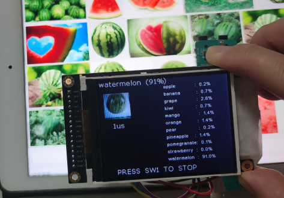

# 项目介绍
    本项目使用MAX78000FTHR板子作为控制器，外部扩展连接一个TFTLCD显示屏，实现一个水果识别器。板载摄像头会实时采集环境图像，然后经过CNN训练好的模型计算出照片中水果与所有类别水果的相识度，然后找出相似度最高的水果并显示。
    本项目能够实现11类水果的识别，分别为苹果，香蕉，葡萄串，猕猴桃，芒果，橘子，梨子，菠萝，石榴，草莓以及西瓜（精简版可以识别苹果，香蕉，葡萄，橘子，梨子，菠萝，西瓜，精度更高）。  

# 项目设计思路
项目设计思路如下图：    
   


1. 首先是收集水果素材，在网上找了一些水果图片，然后截图以及处理变成自己的训练素材；
2. 然后搭建水果识别模型，包括读取数据集数据代码以及训练模型代码（训练模型采用了精简的RES模型）；
3. 然后开始训练模型；
4. 训练玩模型之后需要量化，不然实际应用时识别精度会很低；
5. 之后可以选择对模型进行评估，查看量化后的模型精度是否有丢失以及丢失多少；
6. 评估之后如果模型识别精度在可接受范围之内，就可以对模型进行转换了；
7. 转换模型，生成MAX78000的嵌入式工程
8. 部署模型到MAX78000的嵌入式平台，添加摄像头代码以及TFTLCD显示代码，摄像头实时采集环境图像然后使用CNN进行计算，计算出当前环境采集的水果与事先训练的每种类别的水果的相似度，然后显示在TFTLCD上，识别出相似度最高的水果类别做特殊显示；   

硬件连接（本项目只外接了LCD，连接如下）：
CLK：P0.7
MISO：P0.6
MOSI：P0.5
CS：P0.11
DC：P0.8

# 搜集素材的思路
最开始本来打算自己搜集素材并且标注，但是一般数据量需求比较大，如果只是自己一个人来做的话，费时费力，并且比赛时间也不允许我话费这么多时间自己标注数据，所以在网上搜索了一个比较好的数据集，如下：    
[https://www.kaggle.com/datasets/moltean/fruits](https://www.kaggle.com/datasets/moltean/fruits)  

然后在实际使用该数据集的时候有出现了新的问题，就是该数据集中对图片做了特殊的处理，不适用于真实环境下采集分析，如果使用该数据集训练后的模型进行实际测试，基本上都测试不准。所以我自己在百度/必应等平台上搜集了一些生活中的水果图片，每种类别收集了几十张，然后对这些图片做了剪切等处理，在给部分种类添加了一些fruit-360数据集中的图片，最终组成了我所需要的数据集。   
   
之后再在每种类别的图片中选择出几张或者十几张作为测试图片，测试图片与训练图片不重复，用于在训练的最后测试训练结果。   

我搜集了如下集中类别的素材来完成项目，素材基本上都是针对水果的侧面，不包含360度：
```
苹果
香蕉
葡萄簇（只针对一串葡萄，不针对单个葡萄）
猕猴桃（精简版无）
芒果（精简版无）
橘子
梨子
菠萝
石榴（精简版无）
草莓（精简版无）
西瓜
```


   
我的数据集和代码放置在一起，都放置到了gitee，见文末。   

# 预训练实现过程
## 前言
> 本文将对11类水果以及7类水果的训练实现过程都做说明，如果没有特殊说明，表示对于这两种类别的实现都是一致的。不一致都会进行特殊说明。11类水果表示水果种类为11中，7类水果表示水果种类为7中。

官方提供的案列cats-vs-dogs也是图像识别，与我所需要做的作品相似度比较高，本来打算使用cat-vs-dogs的现成的模型来训练我的数据集的，经过实测，其训练时的最好精度为93.919%，测试的最好精度为86.846%，可以满足我的需求。    
```
2023-01-14 13:17:39,692 - ==> Best [Top1: 93.919   Top5: 100.000   Sparsity:0.00   Params: 58544 on epoch: 223]
2023-01-14 13:17:39,692 - Saving checkpoint to: logs/2023.01.14-130311/qat_checkpoint.pth.tar
2023-01-14 13:17:39,727 - --- test ---------------------
2023-01-14 13:17:39,727 - 114 samples (256 per mini-batch)
2023-01-14 13:17:41,144 - Test: [    1/    1]    Loss 0.406078    Top1 86.842105    Top5 99.122807    
2023-01-14 13:17:41,174 - ==> Top1: 86.842    Top5: 99.123    Loss: 0.406
```
   
但是我最后使用了精简的res模型来测试，最好精度可以达到93.919%,与cats-vs-dogs一致，但是测试精度可以达到90.351%，比cats-vs-dogs的模型高一些，所以最终选择了精简的res模型来测试 。     
```
==> Best [Top1: 91.216   Top5: 100.000   Sparsity:0.00   Params: 80608 on epoch: 583]
Saving checkpoint to: logs/2023.01.14-165720/qat_checkpoint.pth.tar
--- test ---------------------
114 samples (240 per mini-batch)
Test: [    1/    1]    Loss 0.311681    Top1 90.350877    Top5 99.122807    
==> Top1: 90.351    Top5: 99.123    Loss: 0.312
```
   
使用7类水果的精简版res模型测试，精度更高。

## 数据集读取
将数据集分好类并放置到目录ai8x-training/data/fruit下。  
然后在ai8x-training/datasets下新建一个文件fruit.py，用于编写读取数据集的代码：
就数据集的图片都转换成64X64大小，彩色三通道。

### 11类水果数据集读取代码

```python
import torch.nn as nn
import torchvision
from torchvision import transforms

import ai8x

def fruit_get_datasets(data, load_train=True, load_test=True):
    (data_dir, args) = data

    image_size = (64, 64)               #图片大小为64X64

    if load_train:
        train_data_path = data_dir + '/fruit/train_datasets/'
        train_transforms = transforms.Compose([
                            transforms.RandomHorizontalFlip(),      #随机翻转，水平方向
                            transforms.Resize(image_size),
                            transforms.ToTensor(),                  #转化成Tensor
                            # transforms.Normalize(mean=[0.485,0.456,0.406],
                            #                     std=[0.229,0.224,0.225])]),
                            ai8x.normalize(args=args)
                        ])

        train_dataset = torchvision.datasets.ImageFolder(root = train_data_path,
                                             transform = train_transforms)

    else:
        train_dataset = None

    if load_test:
        test_data_path = data_dir + '/fruit/test_datasets/'

        test_transforms = transforms.Compose([
                            transforms.Resize(image_size),  
                            transforms.ToTensor(),
                            # transforms.Normalize(mean=[0.485,0.456,0.406],
                            #                         std=[0.229,0.224,0.225])]) #标准化处理
                            ai8x.normalize(args=args)
                        ])

        test_dataset = torchvision.datasets.ImageFolder(root = test_data_path,
                                             transform = test_transforms)

        if args.truncate_testset:
            test_dataset.data = test_dataset.data[:1]
    else:
        test_dataset = None

    return train_dataset, test_dataset

datasets = [
    {
        'name': 'fruit',
        'input': (3, 64, 64),
        'output': ('apple', 'banana', 'grape', 'kiwi', 'mango', 'orange', 'pear',
                   'pineapple', 'pomegranate', "strawberry", "watermelon"),
        'loader': fruit_get_datasets,
    },
]
```

### 7类水果数据集读取代码
```python
import torch.nn as nn
import torchvision
from torchvision import transforms

import ai8x


def fruit_get_datasets(data, load_train=True, load_test=True):
    (data_dir, args) = data

    image_size = (64, 64)               #图片大小为64X64

    if load_train:
        train_data_path = data_dir + '/fruit/train_datasets/'
        train_transforms = transforms.Compose([
                            transforms.RandomHorizontalFlip(),      #随机翻转，水平方向
                            transforms.Resize(image_size),
                            transforms.ToTensor(),                  #转化成Tensor
                            # transforms.Normalize(mean=[0.485,0.456,0.406],
                            #                     std=[0.229,0.224,0.225])]),
                            ai8x.normalize(args=args)
                        ])

        train_dataset = torchvision.datasets.ImageFolder(root = train_data_path,
                                             transform = train_transforms)

    else:
        train_dataset = None

    if load_test:
        test_data_path = data_dir + '/fruit/test_datasets/'

        test_transforms = transforms.Compose([
                            transforms.Resize(image_size),  
                            transforms.ToTensor(),
                            # transforms.Normalize(mean=[0.485,0.456,0.406],
                            #                         std=[0.229,0.224,0.225])]) #标准化处理
                            ai8x.normalize(args=args)
                        ])

        test_dataset = torchvision.datasets.ImageFolder(root = test_data_path,
                                             transform = test_transforms)

        if args.truncate_testset:
            test_dataset.data = test_dataset.data[:1]
    else:
        test_dataset = None

    return train_dataset, test_dataset

datasets = [
    {
        'name': 'fruit',
        'input': (3, 64, 64),
        'output': ('apple', 'banana', 'grape', 'orange', 'pear',
                   'pineapple', "watermelon"),
        'loader': fruit_get_datasets,
    },
]
```

## 模型搭建
搭建训练模型，ai8x-training/models下新建一个文件ai85net-fruit.py，填入如下内容：

### 11类水果模型
```python
import torch
import torch.nn as nn

import ai8x

class AI85Net_Fruit(nn.Module):
    def __init__(self, num_classes=11, num_channels=3,dimensions=(64, 64),  bias=False, **kwargs):
        super().__init__()

        self.conv1 = ai8x.FusedMaxPoolConv2dReLU(num_channels, 16, 3, pool_size=2, pool_stride=2,
                                                 stride=1, padding=1, bias=bias, **kwargs)
        self.conv2 = ai8x.FusedConv2dReLU(16, 20, 3, stride=1, padding=1, bias=bias, **kwargs)
        self.conv3 = ai8x.FusedConv2dReLU(20, 20, 3, stride=1, padding=1, bias=bias, **kwargs)
        self.conv4 = ai8x.FusedConv2dReLU(20, 20, 3, stride=1, padding=1, bias=bias, **kwargs)
        self.resid1 = ai8x.Add()
        self.conv5 = ai8x.FusedMaxPoolConv2dReLU(20, 20, 3, pool_size=2, pool_stride=2,
                                                 stride=1, padding=1, bias=bias, **kwargs)
        self.conv6 = ai8x.FusedConv2dReLU(20, 20, 3, stride=1, padding=1, bias=bias, **kwargs)
        self.resid2 = ai8x.Add()
        self.conv7 = ai8x.FusedConv2dReLU(20, 44, 3, stride=1, padding=1, bias=bias, **kwargs)
        self.conv8 = ai8x.FusedMaxPoolConv2dReLU(44, 48, 3, pool_size=2, pool_stride=2,
                                                 stride=1, padding=1, bias=bias, **kwargs)
        self.conv9 = ai8x.FusedConv2dReLU(48, 48, 3, stride=1, padding=1, bias=bias, **kwargs)
        self.resid3 = ai8x.Add()
        self.conv10 = ai8x.FusedMaxPoolConv2dReLU(48, 32, 3, pool_size=2, pool_stride=2,
                                                  stride=1, padding=0, bias=bias, **kwargs)

        self.fc = ai8x.Linear(32*2*2, num_classes, bias=True, wide=True, **kwargs)
        for m in self.modules():
                if isinstance(m, nn.Conv2d):
                    nn.init.kaiming_normal_(m.weight, mode='fan_out', nonlinearity='relu')

    def forward(self, x):  # pylint: disable=arguments-differ
        """Forward prop"""

        x = self.conv1(x)  # 16x32x32
        x_res = self.conv2(x)  # 20x32x32
        x = self.conv3(x_res)  # 20x32x32
        x = self.resid1(x, x_res)  # 20x32x32
        x = self.conv4(x)  # 20x32x32
        x_res = self.conv5(x)  # 20x16x16
        x = self.conv6(x_res)  # 20x16x16
        x = self.resid2(x, x_res)  # 20x16x16
        x = self.conv7(x)  # 44x16x16
        x_res = self.conv8(x)  # 48x8x8
        x = self.conv9(x_res)  # 48x8x8
        x = self.resid3(x, x_res)  # 48x8x8
        x = self.conv10(x)  # 96x4x4
        x = x.view(x.size(0), -1)
        x = self.fc(x)
        return x


def ai85net_fruit(pretrained=False, **kwargs):
    """
    Constructs a AI85Net5 model.
    """
    assert not pretrained
    return AI85Net_Fruit(**kwargs)

models = [
    {
        'name': 'ai85net_fruit',
        'min_input': 1,
        'dim': 2,
    },
]
```

### 7类水果模型
```python

```

然后在ai8x-training/policies下新建一个文件schedule-fruit.py，填写如下训练参数：
```
---
lr_schedulers:
  training_lr:
    class: MultiStepLR
    milestones: [80, 140]
    gamma: 0.2

policies:
  - lr_scheduler:
      instance_name: training_lr
    starting_epoch: 0
    ending_epoch: 600
    frequency: 1
```

## 训练模型
按照上述步骤，模型已经算是搭建完成了，接下来就开始对模型进行训练了。  

1. 进入虚拟环境，按照下面的步骤：
```
cd ~/AI/ai8x-training/
pyenv local 3.8.11
python -m venv venv --prompt ai8x-training
source venv/bin/activate
```

2. 在ai8x-training/scripts下新建一个文件train_fruit.sh，填写如下内容：  
```
python train.py --epochs 600  --optimizer Adam --lr 0.0001 --wd 0 --batch-size 240 --gpus 0 --deterministic --compress policies/schedule-fruit.yaml --model ai85net_fruit --dataset fruit --param-hist --pr-curves --embedding --device MAX78000 "$@"
```

3. 之后在终端中输入如下代码就可以开始训练了，等待训练结束即可。
```
scripts/train_fruit.
```

### 11类水果训练结果


由此可知，训练时最好的结果为91.216%，测试时，最好的结果为90.351%，能够达到90%以上，算是比较好的测试结果了，可以使用该测试结果进行量化。

### 7类水果训练结果

由此可知，训练时最好的结果为**99.010%**，测试时，最好的结果为**92.5%**，能够达到92%以上，比11类水果的时候好很多。
  

训练结束之后会将训练结果保存在ai8x-training/logs下，查看训练记录找到训练记录，找到训练模型保存位置。


## 模型量化
1. 切换到目录ai8x-synthesis
```
cd ~/AI/ai8x-synthesis
```

2. 将训练好的模型模型拷贝到ai8x-synthesis/trained目录下，拷贝的时候需要注意路径是否正确：
```
cp ../ai8x-training/logs/2023.01.14-165720/qat_best.pth.tar trained/ai8x-fruit-qat8.pth.tar
```
qat_best.pth.tar模型是保存的最好的训练结果，并且是在训练时被量化的结果，经过实验验证，使用这个模型来量化能得到最好的量化结果。  
ai8x-fruit-qat8.pth.tar是用户自定义的文件名,为复制之后的名字。

1. 在script目录下新建一个quantize.sh文件，将下述代码填进去，保存.
```
#!/bin/sh
python quantize.py trained/ai8x-fruit-qat8.pth.tar trained/ai8x-fruit-qat8-q.pth.tar --device MAX78000 -v "$@"
```

其中，ai8x-fruit-qat8-q.pth.tar为用户自定义名字，即量化后的模型名。

1. 使用下面的命令开始模型量化：  
```
scripts/quantize_fruit.sh
```

量化的过程很快，打印信息如下,表示量化完成。  


完成上一步之后会在trained目录下生成一个文件ai8x-fruit-qat8-q.pth.tar，留作后面步骤使用。  

## 模型评估
1. 切换到训练目录ai8x-training
```
cd ~/AI/ai8x-training/
```

2. 创建评估脚本，在scripts目录下新建一个文件evaluate_fruit.sh，在其中写入评估脚本代码：
```
#!/bin/sh
python train.py --model ai85net_fruit --dataset fruit --confusion --evaluate --exp-load-weights-from ../ai8x-synthesis/trained/ai8x-fruit-qat8-q.pth.tar -8 --device MAX78000 "$@"

```

3. 使用下面的命令开始评估：  
```
scripts/evaluate_fruit.sh
```

### 11类水果量化后的模型评估结果如下：


测试精度能够达到89.474%，与训练时的测试结果（90.351%）差别不大，说明模型大体上是满足要求的。   

### 7类水果量化后的模型评估结果如下：


测试精度能够达到92.5%，与训练时的测试结果（92.5%）一致，并且结果好于11类水果测试精度，说明结果很好。    

# 模型转换
1. 编辑yaml配置文件，在ai8x-synthesis/networks目录下新建一个文件fruit.yaml,填入下面的内容：     
```
---
# HWC (big data) configuration for fruit

arch: ai85net_fruit
dataset: fruit

# Define layer parameters in order of the layer sequence

layers:
  # Layer 0
  - out_offset: 0x2000
    processors: 0x0000000000000007
    operation: conv2d
    kernel_size: 3x3
    max_pool: 2
    pool_stride: 2
    pad: 1
    activate: ReLU
    data_format: HWC

  # Layer 1
  - out_offset: 0x0000
    processors: 0x0ffff00000000000
    operation: conv2d
    kernel_size: 3x3
    pad: 1
    activate: ReLU

  # Layer 2 - re-form data with gap
  - out_offset: 0x2000
    processors: 0x00000000000fffff
    output_processors: 0x00000000000fffff
    operation: passthrough
    write_gap: 1

  # Layer 3
  - in_offset: 0x0000
    in_sequences: 1
    out_offset: 0x2004
    processors: 0x00000000000fffff
    operation: conv2d
    kernel_size: 3x3
    pad: 1
    activate: ReLU
    write_gap: 1

  # Layer 4 - Residual-1
  - in_sequences: [2, 3]
    in_offset: 0x2000
    out_offset: 0x0000
    processors: 0x00000000000fffff
    eltwise: add
    operation: conv2d
    kernel_size: 3x3
    pad: 1
    activate: ReLU

  # Layer 5
  - out_offset: 0x2000
    processors: 0xfffff00000000000
    output_processors: 0x000000fffff00000
    max_pool: 2
    pool_stride: 2
    pad: 1
    operation: conv2d
    kernel_size: 3x3
    activate: ReLU

  # Layer 6 - re-form data with gap
  - out_offset: 0x0000
    processors: 0x000000fffff00000
    output_processors: 0x000000fffff00000
    op: passthrough
    write_gap: 1

  # Layer 7 (input offset 0x0000)
  - in_offset: 0x2000
    in_sequences: 5
    out_offset: 0x0004
    processors: 0x000000fffff00000
    operation: conv2d
    kernel_size: 3x3
    pad: 1
    activate: ReLU
    write_gap: 1

  # Layer 8 - Residual-2 (input offset 0x2000)
  - in_sequences: [6, 7]
    in_offset: 0x0000
    out_offset: 0x2000
    processors: 0x000000fffff00000
    eltwise: add
    operation: conv2d
    kernel_size: 3x3
    pad: 1
    activate: ReLU

  # Layer 9
  - out_offset: 0x0000
    processors: 0x00000fffffffffff
    max_pool: 2
    pool_stride: 2
    pad: 1
    operation: conv2d
    kernel_size: 3x3
    activate: ReLU

  # Layer 10 - re-form data with gap
  - out_offset: 0x2000
    processors: 0x0000ffffffffffff
    output_processors: 0x0000ffffffffffff
    op: passthrough
    write_gap: 1

  # Layer 11
  - in_offset: 0x0000
    in_sequences: 9
    out_offset: 0x2004
    processors: 0x0000ffffffffffff
    operation: conv2d
    kernel_size: 3x3
    pad: 1
    activate: ReLU
    write_gap: 1

  # Layer 12 - Residual-3
  - in_sequences: [10, 11]
    in_offset: 0x2000
    out_offset: 0x0000
    processors: 0x0000ffffffffffff
    eltwise: add
    max_pool: 2
    pool_stride: 2
    pad: 0
    pool_first: false
    operation: conv2d
    kernel_size: 3x3
    activate: ReLU

    # Layer 13 - LINNER
  - out_offset: 0x2000
    processors: 0x000000000ffffffff
    operation: mlp
    flatten: true
    output_width: 32
```

2. 生成测试样本  
生成的测试样本用于模型转换的时候生成MAX78000的测试工程，测试工程的代码不做任何修改就可以基于测试样本进行测试工作，直接在终端中输入如下命令：   
```
python ./train.py --model ai85net_fruit --save-sample 10 --dataset fruit --evaluate --exp-load-weights-from ../ai8x-synthesis/trained/ai8x-fruit-qat8-q.pth.tar -8 --device MAX78000 "$@"
```

终端中打印如下内容表示生成样本成功：   
11类水果打印信息：


7类水果打印信息：


3. 移动样本文件sample_fruit.npy到ai8x-synthesis/tests目录，用于后续生成demo工程。  
使用如下命令移动：  
```
cp sample_fruit.npy ../ai8x-synthesis/tests/sample_fruit.npy
```

# 模型转换
1. 切换到ai8x-synthesis目录   
```
cd ~/AI/ai8x-synthesis/
```

2. 生成模型的C代码以及工程文件
在ai8x-synthesis/demos/下新建一个目录ai8x-fruit用于保存生成的工程文件，然后在终端中执行下面的命令： 
```
python ./ai8xize.py --verbose --test-dir demos --prefix ai8x-fruit --checkpoint-file trained/ai8x-fruit-qat8-q.pth.tar --config-file networks/fruit.yaml --device MAX78000 --compact-data --mexpress --softmax
```

如果已经有文件存在，则在命令后面加上 --overwrite覆盖之前生成的文件，即：
```
python ./ai8xize.py --verbose --test-dir demos --prefix ai8x-fruit --checkpoint-file trained/ai8x-fruit-qat8-q.pth.tar --config-file networks/fruit.yaml --device MAX78000 --compact-data --mexpress --softmax --overwrite
```

如下，表示生成模型代码以及测试Demo工程成功。


生成的文件在demos/ai8x-fruit目录下。   


然后使用Eclipse MaximSDK将该工程导入到workspace就可以直接编译，下载验证功能了。  

## 编写识别代码
实现代码使用到了摄像头以及TFTLCD，将相应代码集成到工程中。  
代码中主要实现的功能如下：
1. 启动之后会显示作品信息；
2. 按下SW1开始启动水果识别器识别摄像头采集到的图片中的水果，此时红色LED周期闪烁；
3. 软件采用实时刷新，摄像头会一直采集照片信息，然后检测，并通过LCD显示出现相似度最高的类别的水果；
4. 所有类别的水果的相似率都会显示在LCD屏最右部分；
5. 再次按下SW1停止采样识别，暂停程序运行，绿色LED亮。
  
代码存放在gitee上，文件见本文末尾gitee链接

# 实现结果展示
经过试验测试，水果识别的精度还需要进一步优化，对于相似度比较高的水果，可能会识别错误。   
容易识别出错的水果：【草莓，芒果，猕猴桃，橘子，石榴】，估计是这几类水果的特征与其他水果比较类似，因为照片上并不能判断出水果的大小，数据集中的水果图片也是经过压缩的。本来想删除这几类水果，在做一个水果识别器，但是删除之后剩下的就没有几种类别了，就保留了下来，虽然这几类不太好识别，但是最终还是能够被识别出来，已经满足要求了。  
我分析了几种原因：
1. 样本数据太少（网上查找数据集确实比较难，都是采用截图的方式，难免存在干扰）；
2. 有些水果相识度比较高，比如，苹果和石榴和橘子，他们形状类似，经常会识别出错；
3. 模型还需要优化，当前模型是精简过多，因为完整的模型测试出来在模型转换的时候会超内存，这点不可避免，会导致精度丢失。

但是目前的项目也算是比较完美的完成了，基本上每种种类的水果都可以识别出来。后期优化方向主要集中在数据集的采集上（打算自己买水果拍照，采集的数据集应该比较好一些）

> 针对以上11类水果识别精度的缺陷，我删除其中一些数据集，减少水果的种类（保留了7种水果特征区别明显的种类），可以加大测试精度，经过试验验证，精度会提高很多，基本上每种类别的水果都能够很快识别出来，其过程也在上文中进行了描述。

下面展示一些识别图片，图片都是在网上找的，就是为了验证识别精度，没有直接使用训练和测试的图片。   
   
橘子：   
   
苹果：   
   
香蕉：   
   
葡萄：    
   
梨子：  
   
草莓：  
   
芒果：  
   
猕猴桃：  
   
菠萝：   
   
石榴：   
   
西瓜：   
   
   
视频展示链接(bilibili)：   
[https://www.bilibili.com/video/BV1T24y1h7Qc/](https://www.bilibili.com/video/BV1T24y1h7Qc/)   
    
7个水果种类水果识别，试验验证表明精度更高了，识别速度更快了，可以作为一个水果识别器使用,如下视频，一镜到底。   
[https://www.bilibili.com/video/BV1KG4y1C7Fn/](https://www.bilibili.com/video/BV1KG4y1C7Fn/)
   

# 遇到的主要难题及解决方法，或未来的计划或建议等

1. 环境搭建问题  
问题描述： 我的环境搭建使用的是windows+WSL2的方式，由于没有npv，环境搭建过程需要从外网（如github）中下载资源，导致下载速度很慢，还会经常下载不成功。  
解决方式：  
建议：如果能够将环境搭建中使用的资源放置在国内的网站（如gitee）上，对开发者而言会非常友好。
  
2. 模型训练过程
问题描述：MAX78000的模型训练流程相对而言还是比较繁琐，对于新手非常不友好，而且也区别于电脑上实现的模型训练流程。
解决方式：参考Maxim提供的案列以及网友提供的教程完成训练过程。
建议：可否提供一个训练平台，让用户可以直接在提供的平台上进行模型的搭建以及训练，可以解决大部分训练中的问题。

3. 串口打印乱码
问题描述：下载了一个freeRTOS的代码到板子中，发现串口打印的数据乱码。
解决方案：更新了最新版的固件，乱码问题消失。

4. 有些水果识别精度不够的问题
问题描述：最开始使用了11种类别的水果，结果试验测试时，像石榴，芒果，橘子，猕猴桃，草莓等这些水果容易被混淆，真实环境测试精度不高。
解决方案：减少了水果识别种类，从11类减少到7类，删除了石榴，芒果，猕猴桃和草莓，保留苹果，香蕉，梨子，菠萝，西瓜，橘子，葡萄之后，试验测试真实环境采样精度会提高很多，这七类水果特征区别明显，能够容易被甄别出来。

未来计划：会使用手头的MAX78000FHTR开发板继续学习CNN，本人也是第一次接触CNN，第一次接触边缘计算，本次活动也学习到了很多，了解pytorch，学会了如何在单片机上座人工智能识别，知道了实现一个CNN神经网络的流程，我也会继续学习下去，争取利用MAX78000开发板让自己迈入神经网络的世界。


# 可编译下载的代码（放在项目的附件，用于验证）
项目实现的所有文件都放在了gitee。    
包括数据集，模型代码，项目工程以及训练量化过程中的logs等。   
本仓库可以下载，也可以在百度云下载：
链接：https://pan.baidu.com/s/1B8k7zRZFdufAWi-wYxCFyA?pwd=6mwv 
提取码：6mwv 
复制这段内容后打开百度网盘手机App，操作更方便哦
  
文件目录说明：


# 总结
本次比赛受益匪浅，让我一个神经网络小白向神经网络方向迈进了一步，了解到了单片机的强大，神经网络也可以应用在单片机上，我也非常看好神经网络在单片机上的应用前景单片机上做AI识别确实是未来的一大方向，本人也会再接再厉，赶上时代的浪潮。
期望未来Maxim能够将边缘计算做大做强，让用户开发更便捷，识别更精确。  
感谢电子森林，Maxim硬禾与ADI给予的本次机会。  

